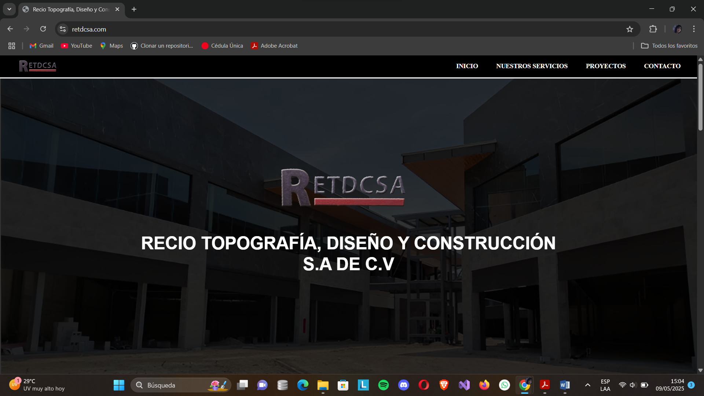

# Residencia-Sitio-web-RETDCSA

Este proyecto consiste en el diseño y desarrollo completo de un sitio web corórativo desde cero, utilizando tecnologías web fundamentales como **HTML5**, **CSS3** y **JavaScript**. 
El sitio está enfocado en la presentación profesional de una empresa, implementando buenas prácticas de diseño responsivo y estrategias de **SEO (Search Engine Optimization)** para mejorar su visibilidad en motores de búsqueda.

## 📌 Objetivo

Crear un sitio web funcional, atractivo y accesible que represente a una empresa o negocio, brindando información clara sobre sus servicios, misión, visión, valores, proyectos y medios de contacto.

## 🛠️ Tecnologías Utilizadas

- **HTML5**: Estructura semántica del contenido.
- **CSS3**: Estilización y diseño visual, incluyendo layout responsivo con media queries y Flexbox/Grid.
- **JavaScript**: Interactividad en elementos como menús, sliders, animaciones, y validaciones de formularios.
- **SEO**: Uso de etiquetas semánticas, meta etiquetas, títulos jerárquicos, atributos `alt` en imágenes y optimización del rendimiento.
- **Diseño Responsivo (Responsive Design)**: Adaptación del sitio a diferentes dispositivos (móviles, tabletas, escritorios).

  ## 📋 Características Principales

- Diseño limpio, moderno y centrado en la experiencia del usuario (UX).
- Navegación clara con menú fijo y anclajes a secciones.
- Secciones:
  - **Inicio**
  - **Sobre Nosotros** (Misión, Visión y Valores)
  - **Servicios**
  - **Proyectos**
  - **Contacto**
- Animaciones suaves con JavaScript.
- Compatibilidad con los principales navegadores modernos.
- Optimización para dispositivos móviles.
- Enlace a mapa de ubicación y formulario de contacto funcional.

### Vista Previa del Proyecto

### Contacto
Si te gustaria invitarme a colaborar en un proyecto, contáctame a mi córreo meli178a@gmail.com o escribeme por [LinkedIn](https://www.linkedin.com/in/melissa-ochoa17/)
